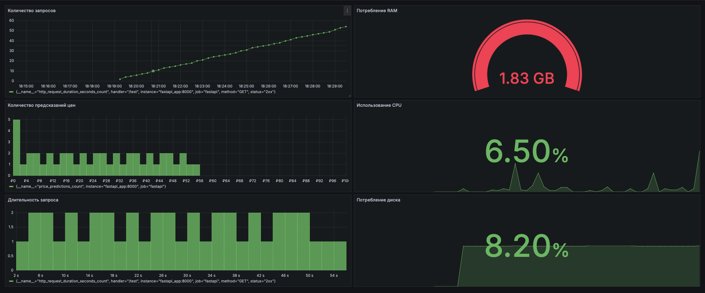

# Мониторинг

## Для мониторинга выбраны метрики нескольких метрик:
Использовались два типа клиентов Histogram, Gauge

Использовала метрики: 
1. Количество запросов во времени. Для отслеживания пользования сервисом
2. Гистаграмму распределение предсказанных цен. Для понимания распределения предсказанных значения
3. Длительность запроса. Для понимания скорости ответа сервиса и последующем его улучшении
4. Потребление RAM, SPU для понимания нагрузги на сервер.

для тестирования нагрузки использован test_requests.py